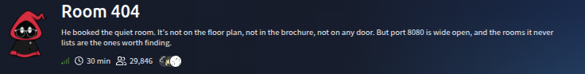
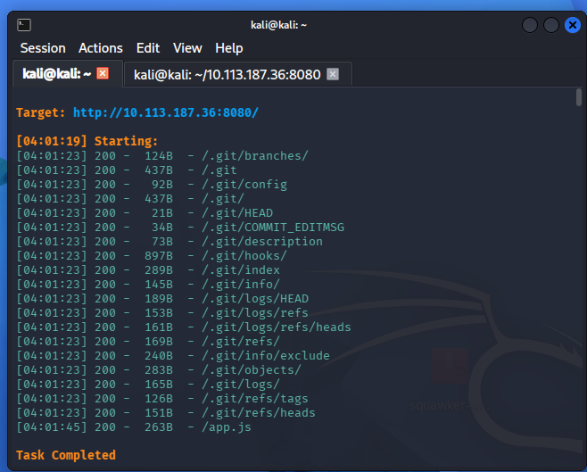
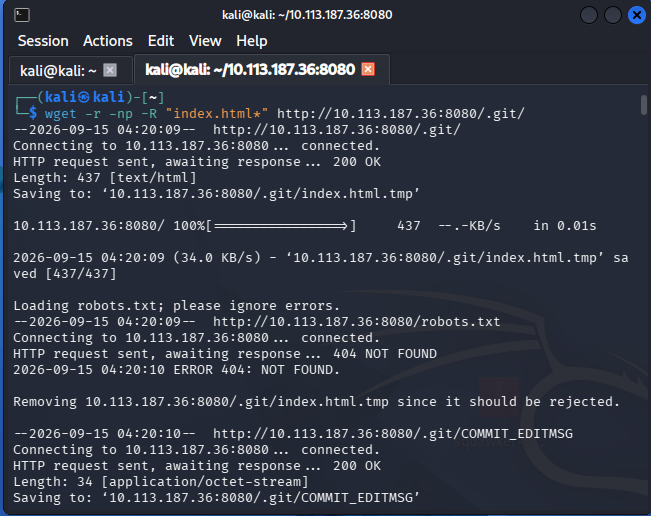
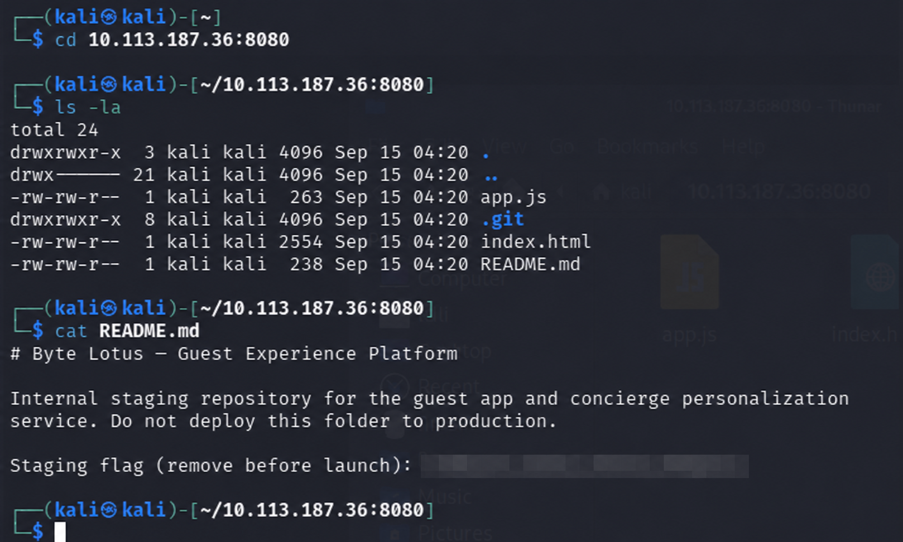

# Room 404



## Overview

Room 404 is a web-security challenge built around an application exposed on TCP port `8080`. The objective is to inspect content that is not linked from the visible application and identify sensitive development artifacts accidentally deployed with the site.

The key issue is a publicly accessible `.git` directory. Git metadata can expose source code, commit history, configuration, deleted content, and developer notes. In this case, the exposed files led to an internal repository note containing the challenge flag.

## Reconnaissance

The application was available at the target host on port `8080`:

```text
http://<TARGET_IP>:8080/
```

A content-discovery scan returned multiple successful responses below `/.git/`, including:

- `/.git/HEAD`
- `/.git/config`
- `/.git/index`
- `/.git/logs/`
- `/.git/objects/`
- `/.git/refs/`

The same scan also identified `app.js`.



The presence of Git internals confirms that repository metadata is being served by the web server and can be retrieved without authentication.

## Downloading the exposed repository

The accessible `.git` tree was downloaded recursively with `wget`:

```bash
wget -r -np -R "index.html*" http://<TARGET_IP>:8080/.git/
```

Options used:

- `-r` recursively downloads linked content;
- `-np` prevents traversal to parent directories;
- `-R "index.html*"` rejects generated directory-index files.



## Reviewing the recovered files

After downloading the accessible project files, the local directory contained the application files, the `.git` directory, and a `README.md` file:

```bash
cd <TARGET_IP>:8080
ls -la
cat README.md
```

The README identified the directory as an internal staging repository for the Byte Lotus guest application. It also contained a staging flag that should have been removed before deployment. The flag is redacted in the screenshot and is not reproduced here.



## Finding

**Vulnerability:** publicly accessible Git repository metadata.

**Impact:** an unauthenticated user may recover source code, repository history, configuration, internal notes, credentials, or other sensitive information committed to the repository.

## Remediation

- Never deploy the `.git` directory to a production web root.
- Deny web access to dotfiles and version-control directories at the server or reverse-proxy layer.
- Build deployment artifacts from a clean export rather than copying the working directory.
- Scan public assets for secrets and development files during CI/CD.
- Rotate any credential or token that has ever been exposed in repository history.

## Takeaway

Unlinked content is not private content. A forgotten `.git` directory can disclose much more than the visible application and should be treated as a serious information-exposure issue.
