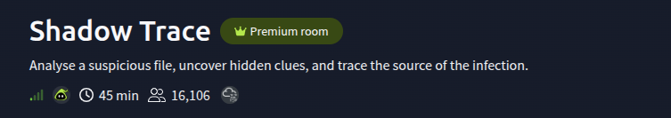
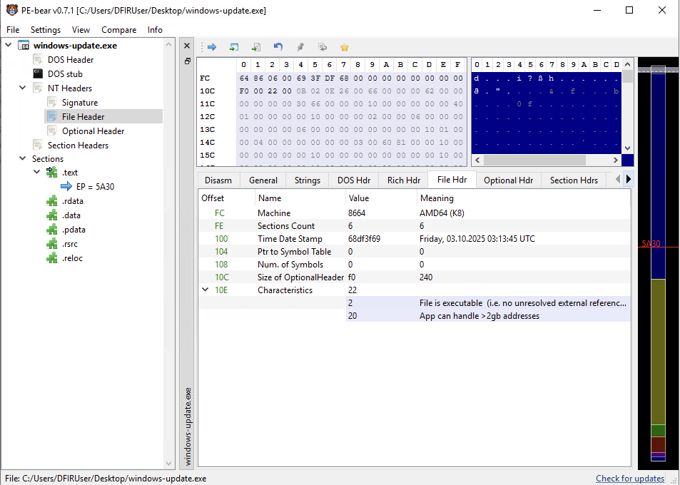
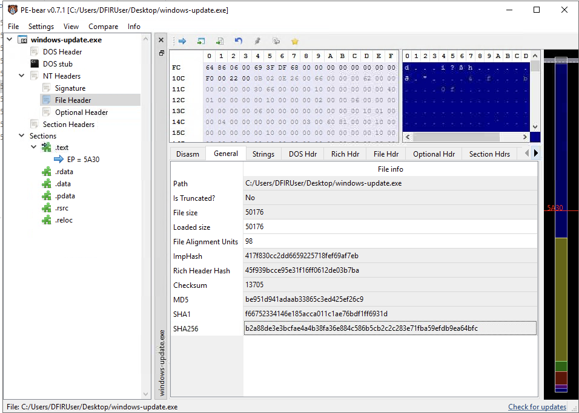
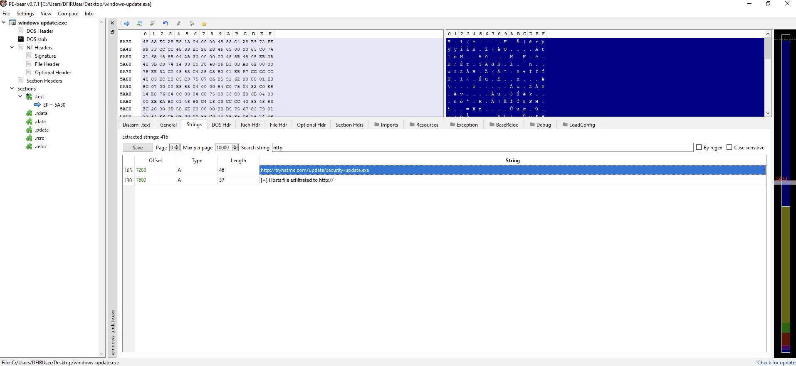
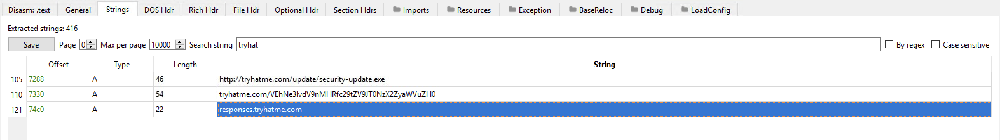
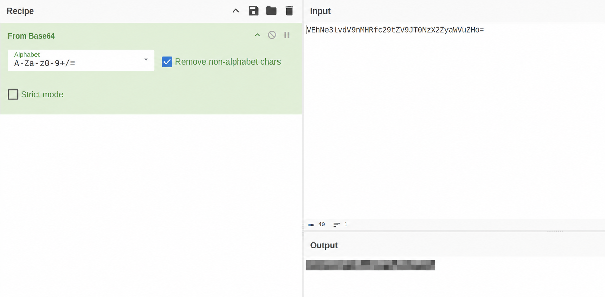
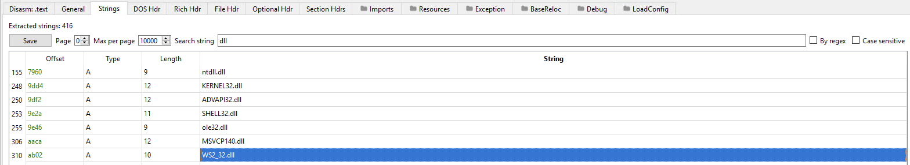
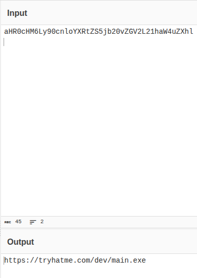
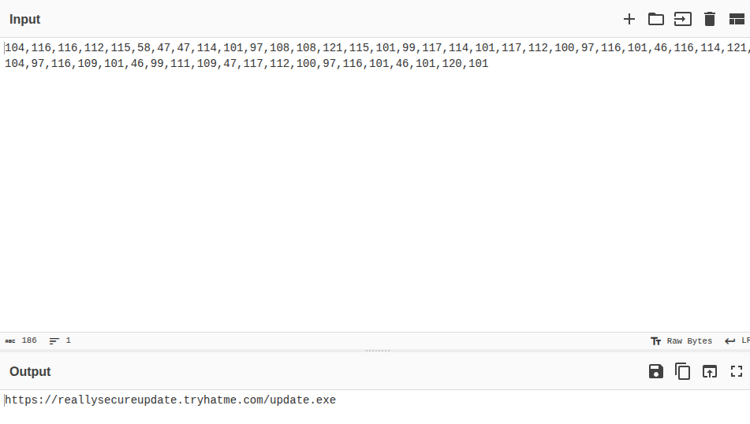
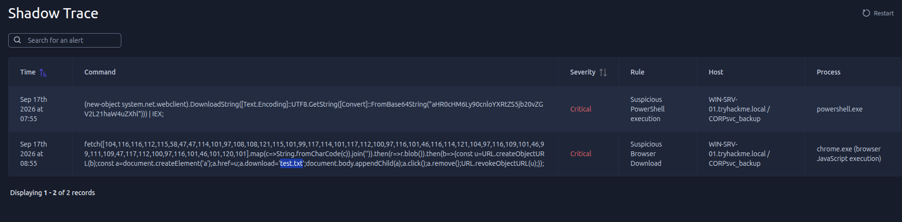

# Shadow Trace



## Overview

Shadow Trace is a malware-analysis and incident-investigation challenge. The sample, `windows-update.exe`, is examined statically in PE-bear. Strings and encoded values recovered from the file are then decoded and correlated with execution events in the Shadow Trace interface.

The analysis combines two perspectives:

1. **Static evidence** from the Portable Executable file: architecture, sections, hashes, imported libraries, URLs, and encoded strings.
2. **Behavioral evidence** from telemetry: PowerShell execution and a browser-based download chain.

No sample execution was required for the steps shown below.

## 1. Inspecting the PE file

Opening `windows-update.exe` in PE-bear shows a 64-bit Windows executable for AMD64 with six sections:

- `.text`
- `.rdata`
- `.data`
- `.pdata`
- `.rsrc`
- `.reloc`



The file-information view provides the sample size and hashes. Recording these values is useful for evidence tracking, duplicate detection, and later IOC enrichment.



## 2. Searching extracted strings

PE-bear extracted 416 strings from the sample. Searching for `http` revealed a download-related URL and a message associated with host-file exfiltration.



A closer view also exposed an encoded value associated with the lab domain. The value used to reveal the challenge flag is intentionally omitted from this write-up.



## 3. Decoding the hidden value

The string had the structure of Base64 data. Decoding it with CyberChef produced the challenge flag. The output is redacted in the public screenshot and is not reproduced in this repository.



## 4. Reviewing networking-related libraries

Searching the strings for DLL names returned standard Windows libraries, including `WS2_32.dll`.



`WS2_32.dll` provides Windows Sockets functionality. Its presence supports the hypothesis that the program can perform network operations, although an imported or embedded library name alone does not prove malicious behavior.

## 5. Decoding additional indicators

A second Base64 value decoded to a URL pointing to `main.exe` on the lab domain:

```text
https://tryhatme.com/dev/main.exe
```



Another string represented a URL as decimal character codes. Converting each value to its character produced:

```text
https://reallysecureupdate.tryhatme.com/update.exe
```



These values are lab indicators and are included for analysis only.

## 6. Correlating the execution events

The Shadow Trace event table contained two critical records on host `WIN-SRV-01.tryhackme.local` under the `CORP\\svc_backup` account:

| Process | Detection | Observed behavior |
| --- | --- | --- |
| `powershell.exe` | Suspicious PowerShell execution | Decoded a Base64 URL, downloaded content with `System.Net.WebClient`, and passed it to `IEX` |
| `chrome.exe` | Suspicious browser download | Reconstructed a URL from decimal character codes, fetched the response, and saved it through browser JavaScript |



The telemetry confirms that the obfuscated values found during static analysis were connected to actual download behavior in the scenario.

## Indicators observed

| Type | Value |
| --- | --- |
| Filename | `windows-update.exe` |
| URL | `http://tryhatme.com/update/security-update.exe` |
| URL | `https://tryhatme.com/dev/main.exe` |
| URL | `https://reallysecureupdate.tryhatme.com/update.exe` |
| Host | `WIN-SRV-01.tryhackme.local` |
| Account | `CORP\\svc_backup` |
| Processes | `powershell.exe`, `chrome.exe` |
| Network-related library | `WS2_32.dll` |

## Analysis conclusion

The sample contains download-related URLs, encoded data, and references consistent with network access. Shadow Trace telemetry then shows PowerShell and browser commands decoding or reconstructing those indicators and using them in download chains. Together, the static and behavioral evidence supports classifying the activity as malicious within the challenge scenario.

## Defensive lessons

- Search suspicious binaries for URLs, encoded blobs, command fragments, and library names.
- Treat Base64 and numeric character arrays as obfuscation, not encryption.
- Correlate static findings with endpoint or process telemetry before drawing a final conclusion.
- Alert on PowerShell download cradles, especially combinations of `FromBase64String`, `WebClient`, and `IEX`.
- Review browser telemetry when JavaScript constructs a URL, creates a blob, and triggers a download programmatically.

## Flag handling

The challenge flag is intentionally redacted from both the screenshots and the text.
